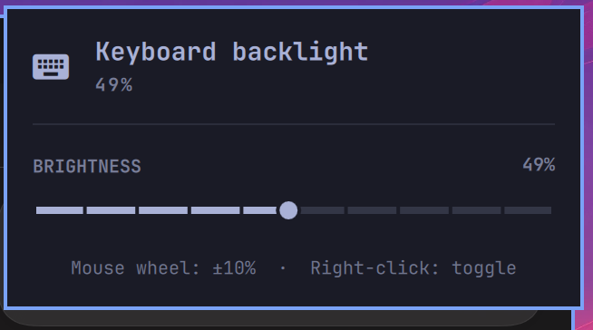

# Keyboard Brightness

An Omarchy bar widget for adjusting the keyboard backlight.



## Features

- Left click opens the brightness slider.
- The mouse wheel adjusts the brightness in 10% steps.
- Right click turns the backlight off or restores its previous brightness.
- Left and right arrow keys adjust the brightness while the panel is open.
- Separate keyboard and keyboard-off icons show the current state at a glance.
- Read and write errors are reported in the tooltip and panel.

The widget controls Linux keyboard-backlight LEDs through `brightnessctl`.
By default, it uses the device wildcard `*kbd_backlight*`, which covers names
such as `kbd_backlight`, `smc::kbd_backlight`, and `tpacpi::kbd_backlight`.

## Compatibility

This plugin was developed and tested on an Apple Silicon M2 MacBook Air
running Omarchy on Linux (`aarch64`). It is an Omarchy/Linux plugin, not a
macOS plugin.

Other computers should work when their kernel exposes the keyboard backlight
as an LED device that `brightnessctl` can read and control. Built-in or
external keyboards that require a vendor-specific control utility may not be
compatible.

## Requirements

- Omarchy shell with third-party bar-widget support
- `brightnessctl`
- Permission for the logged-in user to change the keyboard LED

Install `brightnessctl` through Omarchy if it is not already available:

```sh
omarchy pkg add brightnessctl
```

## Installation

Once this repository is public, install and enable the plugin with:

```sh
omarchy plugin add https://github.com/Anes-03/keyboard-brightness-plugin.git --enable
```

Omarchy installs the plugin below `~/.config/omarchy/plugins/` and places the
widget in its default bar section. If it is installed but not visible, enable
it explicitly:

```sh
omarchy plugin enable io.github.anes-03.keyboard-brightness --section right
```

To update or remove the installed plugin later:

```sh
omarchy plugin update io.github.anes-03.keyboard-brightness
omarchy plugin remove io.github.anes-03.keyboard-brightness
```

Removing the plugin deletes only its installed plugin copy. It does not
uninstall `brightnessctl` or change the keyboard backlight device.

## Settings

The plugin exposes these settings through the Omarchy plugin settings UI:

- `device`: an exact `brightnessctl` device name or wildcard
- `pollIntervalMs`: polling interval while the device is available
- `restorePercent`: fallback used when the plugin starts with the light off

When no matching device is available, polling is automatically slowed down.
The last non-zero brightness is remembered for the lifetime of the widget.
Right-clicking at 0% restores that value. If no non-zero value has been seen
yet, `restorePercent` is used instead.

## Troubleshooting

List the brightness devices detected on the computer:

```sh
brightnessctl -l
```

Test the plugin's default device pattern:

```sh
brightnessctl -d '*kbd_backlight*' info
```

If the keyboard backlight has a different name, enter that exact device name
in the widget settings. If reading succeeds but changing the brightness
fails, check whether the logged-in user has permission to control the device.

Validate an installed copy of the plugin with:

```sh
omarchy plugin validate ~/.config/omarchy/plugins/io.github.anes-03.keyboard-brightness
```

## Tests

Run the parser and boundary tests with Qt's QML test runner:

```sh
QT_QPA_PLATFORMTHEME= QT_QPA_PLATFORM=offscreen \
  /usr/lib/qt6/bin/qmltestrunner -input tests
```

## License

[MIT](LICENSE)
